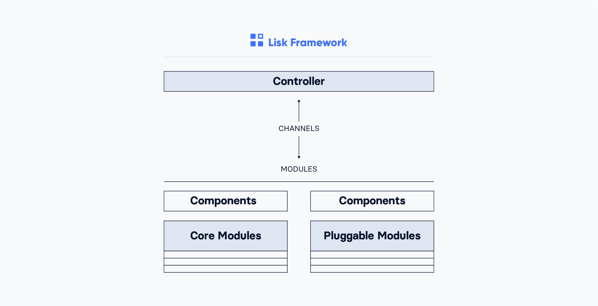

# Lisk Framework

[](http://www.apache.org/licenses/LICENSE-2.0)

## What is Lisk Framework

Lisk Framework is an application framework responsible for establishing and maintaining the interactions between the modules of a Lisk blockchain application.

Lisk Framework aims to provide a consistent and intuitive interface between each module and component. Currently, Lisk Framework establishes interactions between the `chain`, `api` and `network` modules.

### Architecture Overview

The architecture of Lisk Framework follows the research documented in [LIP0005](https://github.com/LiskHQ/lips/blob/master/proposals/lip-0005.md). The diagram below provides a high-level overview of the architecture:



## Installation and usage

To install and use Lisk Framework follow the steps described in the [Lisk SDK installation](https://github.com/LiskHQ/lisk-sdk#installation) and [usage](https://github.com/LiskHQ/lisk-sdk#usage) sections.

## Tests

### Preparing Node

1. Recreate the database to run the tests against a new blockchain:

```
dropdb lisk_dev
createdb lisk_dev
```

2. Launch Lisk (runs on port 4000):

```
NODE_ENV=test npm start
```

### Running Tests

Starting from version `1.6.0`, Lisk Framework will be using [Jest](https://jestjs.io) as its main test runner with gradual deprecation of [mocha](https://mochajs.org). Since rewriting all existing mocha tests is not feasible at the moment, we have two test runners in our code base:

- Modules (all source code under `framework/src/modules` folder) will be tested using `mocha` and test files should be located under `framework/test/mocha`.
- Framework (all of the source files but `framework/src/modules`) will be tested using `jest` and test files should be located under `framework/test/jest`.
- Functional and Network tests suites will be using `mocha` and test files should be located under `framework/test/mocha`.

#### Running Mocha Tests

Tests are run using the following command:

```
npm run mocha:<testType> -- [testPathPattern] [mochaCliOptions]
```

- Where **testType** can be one of `unit`, `integration`, `functional:ws`, `functional:get`, `functional:post`, `functional:put`, `functional`, `network` (required).
- Where **testPathPattern** is a regexp pattern string that is matched against all tests paths before executing the test (optional).
- Where **mochaCliOptions** can be any of mocha's [`command line options`](https://mochajs.org/#command-line-usage) (optional).

Examples:

```
# Running network tests
npm run mocha:network
npm run mocha:network -- --grep @p2p
npm run mocha:network -- --grep @propagation

# Running unit tests
npm run mocha:unit
npm run mocha:unit -- --grep @slow
npm run mocha:unit -- --grep @unstable
### extensive
npm run mocha:unit -- --grep="@unstable" --invert

# Running integration tests
npm run mocha:integration -- --grep @slow
npm run mocha:integration -- --grep @unstable
# extensive
npm run mocha:integration -- --grep="@unstable" --invert

# Running functional tests
npm run mocha:functional:ws
npm run mocha:functional:get
npm run mocha:functional:post
npm run mocha:functional:put
```

Individual test files can be run using the following commands:

```bash
npm run mocha:unit -- <testPathPattern> [mochaCliOptions]
```

or

```bash
npm run mocha <filepath> [mochaCliOptions]
```

or

```bash
npx mocha <filepath> [mochaCliOptions]
```

#### Running Jest Tests

```
npm run jest:<testType>
```

`testType` can be `unit`|`integration`|`functional`

##### Executing the tests per file:

```
npm run jest:<testType> -- [testPathPattern] [jestCliOptions]
```

## Contribution

To test the changes in framework you can run,

`node test/test_app` or `node test/test_app | npx bunyan`

If you want to test the changes in `lisk-sdk/elements` to reflect in `lisk-sdk/framework`, please make sure you run `npm run build` at `lisk-sdk` after making any changes in elements library and run `node test/test_app`.

## Get Involved

| Reason                          | How                                                                                            |
| ------------------------------- | ---------------------------------------------------------------------------------------------- |
| Want to chat with our community | [Reach them on Discord](https://discord.gg/lisk)                                               |
| Found a bug                     | [Open a new issue](https://github.com/LiskHQ/lisk/issues/new)                                  |
| Found a security issue          | [See our bounty program](https://blog.lisk.io/announcing-lisk-bug-bounty-program-5895bdd46ed4) |
| Want to share your research     | [Propose your research](https://research.lisk.io)                                              |
| Want to develop with us         | [Create a fork](https://github.com/LiskHQ/lisk/fork)                                           |

## License

Copyright 2016-2019 Lisk Foundation

Licensed under the Apache License, Version 2.0 (the "License");
you may not use this file except in compliance with the License.
You may obtain a copy of the License at

http://www.apache.org/licenses/LICENSE-2.0

Unless required by applicable law or agreed to in writing, software
distributed under the License is distributed on an "AS IS" BASIS,
WITHOUT WARRANTIES OR CONDITIONS OF ANY KIND, either express or implied.
See the License for the specific language governing permissions and
limitations under the License.

---

Copyright © 2016-2019 Lisk Foundation

Copyright © 2015 Crypti

Permission is hereby granted, free of charge, to any person obtaining a copy of this software and associated documentation files (the "Software"), to deal in the Software without restriction, including without limitation the rights to use, copy, modify, merge, publish, distribute, sublicense, and/or sell copies of the Software, and to permit persons to whom the Software is furnished to do so, subject to the following conditions:

The above copyright notice and this permission notice shall be included in all copies or substantial portions of the Software.

THE SOFTWARE IS PROVIDED "AS IS", WITHOUT WARRANTY OF ANY KIND, EXPRESS OR IMPLIED, INCLUDING BUT NOT LIMITED TO THE WARRANTIES OF MERCHANTABILITY, FITNESS FOR A PARTICULAR PURPOSE AND NONINFRINGEMENT. IN NO EVENT SHALL THE AUTHORS OR COPYRIGHT HOLDERS BE LIABLE FOR ANY CLAIM, DAMAGES OR OTHER LIABILITY, WHETHER IN AN ACTION OF CONTRACT, TORT OR OTHERWISE, ARISING FROM, OUT OF OR IN CONNECTION WITH THE SOFTWARE OR THE USE OR OTHER DEALINGS IN THE SOFTWARE.
